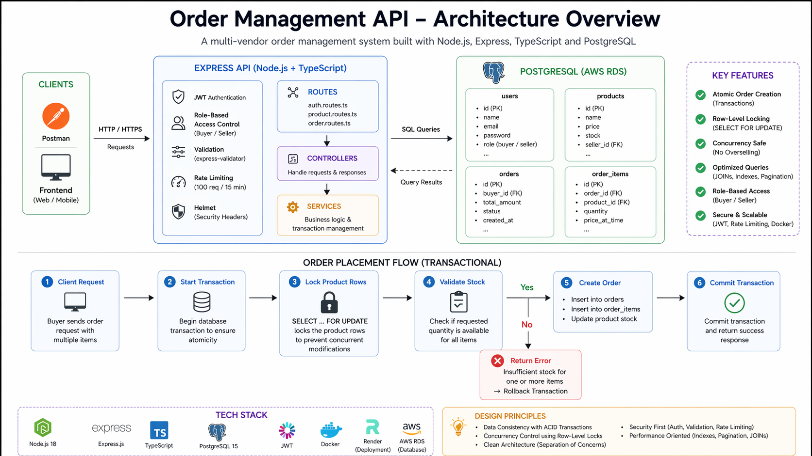

# Order Management API

<div align="center">


**A backend system designed to handle multi-user order placement with a focus on data consistency, concurrency control, and transactional integrity.**  
Buyers can place orders while sellers manage inventory, with safeguards in place to prevent race conditions and ensure stock accuracy under concurrent requests.  

[Live API](https://order-management-api-ruqo.onrender.com) · [Docker Hub](https://hub.docker.com/r/itstirthpatel02/order-management-api) · [GitHub](https://github.com/TirthWillLearn/Order-Management-API)

</div>

---

## Table of Contents

- [Overview](#overview)
- [Key Engineering Highlights](#key-engineering-highlights)
- [Features](#features)
- [Architecture](#architecture)
- [Tech Stack](#tech-stack)
- [Project Structure](#project-structure)
- [Getting Started](#getting-started)
- [Docker](#docker)
- [Environment Variables](#environment-variables)
- [API Reference](#api-reference)
- [Key Engineering Decisions](#key-engineering-decisions)
- [Concurrency Handling](#concurrency-handling)
- [Security](#security)
- [Limitations & Future Improvements](#limitations--future-improvements)
- [Deployment](#deployment)
- [Author](#author)

---

## Overview

This API simulates the backend of a multi-vendor marketplace. It handles product listings, order placement, stock management, and order lifecycle tracking across two user roles — buyers and sellers.

The core engineering challenge: **two buyers attempting to purchase the last available unit simultaneously**. This is solved using PostgreSQL transactions combined with row-level locking (`SELECT FOR UPDATE`), ensuring only one order succeeds and stock never goes negative.

Designed to handle real-world edge cases like concurrent purchases of limited stock, ensuring data consistency under concurrent load.

---

## Key Engineering Highlights

- Prevents overselling using PostgreSQL transactions and row-level locking (`SELECT FOR UPDATE`)
- Ensures atomic order creation across multiple tables (`orders`, `order_items`, `products`)
- Handles concurrent users safely with database-level consistency guarantees
- Optimized queries using JOINs, indexing, and pagination (avoids N+1 problems)

---

## Features

- JWT-based authentication and role-based access control (buyer/seller)
- Transaction-safe order creation with stock validation
- Concurrency handling using PostgreSQL row-level locking (`SELECT FOR UPDATE`)
- Product and inventory management for multi-vendor workflows
- Optimized queries using JOINs, pagination, and indexing
- Rate limiting and request validation for API reliability

---

## Architecture

High-level system design showing API flow and transaction handling.



---

## Tech Stack

| Layer            | Technology        |
| ---------------- | ----------------- |
| Runtime          | Node.js 18        |
| Framework        | Express.js        |
| Language         | TypeScript        |
| Database         | PostgreSQL 15     |
| Authentication   | JWT + bcrypt      |
| Validation       | express-validator |
| Logging          | Morgan            |
| Containerization | Docker            |
| Cloud Database   | AWS RDS / Render DB |
| Hosting          | Render            |

---

## Project Structure

```
src/
├── app.ts
├── config/
│   └── db.ts
├── controllers/
├── services/
├── routes/
├── middlewares/
└── utils/
```

---

## Getting Started

### Prerequisites

- Node.js 18+
- PostgreSQL 15+
- npm

### Setup

```bash
git clone https://github.com/TirthWillLearn/Order-Management-API.git
cd Order-Management-API
npm install
cp .env.example .env
npm run dev
```

---

## Docker

```bash
docker build -t order-api .
docker run --env-file .env -p 10000:10000 order-api
```

---

## Environment Variables

```ini
PORT=10000
DB_HOST=your_db_host
DB_PORT=5432
DB_USER=your_db_user
DB_PASSWORD=your_db_password
DB_NAME=order_management
JWT_SECRET=your_jwt_secret
NODE_ENV=development
```

---

## API Reference

### Auth
- POST `/auth/register`
- POST `/auth/login`

### Products
- GET `/products`
- POST `/products` (seller)

### Orders
- POST `/orders` (transactional)
- GET `/orders`
- GET `/orders/:id`
- PATCH `/orders/:id/status`

---

## Key Engineering Decisions

- Transactions ensure atomic operations across multiple tables  
- `SELECT FOR UPDATE` prevents race conditions during stock updates  
- `price_at_time` preserves historical pricing  
- Separate `orders` and `order_items` for proper relational modeling  

---

## Concurrency Handling

Without locking:
- Multiple users read same stock → overselling

With locking:
- Row is locked → second request waits → correct stock maintained

---

## Security

- bcrypt password hashing  
- JWT authentication  
- Rate limiting (100 req / 15 min)  
- Helmet security headers  
- Environment variable protection  

---

## Limitations & Future Improvements

- Single-instance deployment (no horizontal scaling yet)
- Can add Redis caching for performance
- Can introduce job queues for async processing
- Can scale with load balancers and distributed systems

---

## Deployment

- API: Render  
- DB: AWS RDS / Render DB  
- Docker: Docker Hub  

---

## Author

**Tirth Patel**

GitHub: https://github.com/TirthWillLearn  
LinkedIn: https://www.linkedin.com/in/tirth-k-patel/  
Portfolio: https://tirthdev.in
